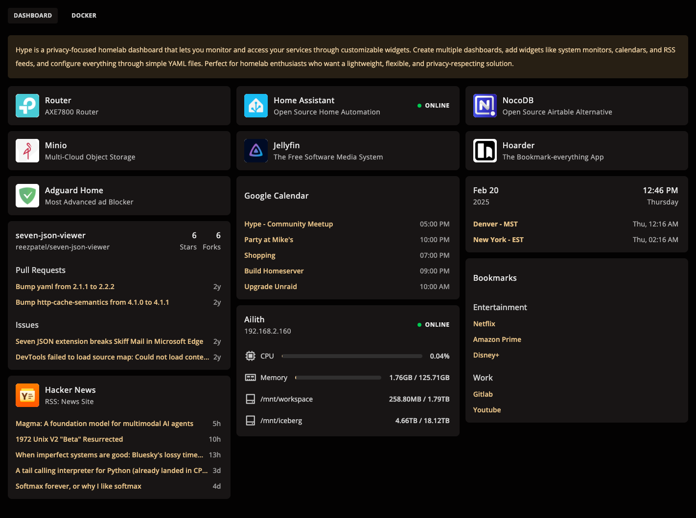

# Hype Dashboard

<div align="center">
  
  
  *A Modern, Privacy-Focused Dashboard for Your Homelab*

  [](https://opensource.org/licenses/GNU)
  [](https://hub.docker.com/r/unpatch/hype)
  [](https://github.com/unpatchlab/hype)
</div>


<div align="center">
  
</div>


## What is Hype?

Hype is a modern, lightweight dashboard designed specifically for homelab enthusiasts who want complete control over their data and interface. It serves as a central hub for monitoring and accessing various services in your homelab environment, all while maintaining your privacy and giving you the flexibility to customize every aspect.

### Key Principles

- **Privacy-First**: No telemetry, no analytics, no external dependencies. Your data stays on your system.
- **Customizable**: Every widget can be configured to match your specific needs.
- **Lightweight**: Minimal resource usage, perfect for running on home servers.
- **Self-Contained**: No external database required - all configuration stored in local files.
- **Modern Stack**: Built with TypeScript, Svelte, and Hono for optimal performance.


## Core Features

### 📊 Multiple Dashboard Support
- Create unlimited dashboard layouts
- Switch between dashboards with a single click
- Organize widgets based on your workflow
- Save different layouts for different purposes (monitoring, media, development, etc.)

### 🧩 Modular Widget System
- Each widget is self-contained and independently configurable
- Masonry layout for widgets
- Adjustable widget refresh rates
- Support for custom CSS themes

### 💨 Performance & Security
- Efficient real-time updates
- Lazy loading of widget data
- Optimized for modern browsers
- No external API calls unless configured

## Available Widgets

- **App Launcher**: Quick access to your frequently used applications
- **Calendar**: View today's upcoming events
- **GitHub Integration**: Monitor repository status, issues, and pull requests
- **RSS Reader**: Stay updated with your favorite feeds
- **System Monitor**: Track CPU, Memory, and Disk usage (requires Telegraf)
- **World Clock**: Display multiple timezones at a glance


## Installation [In Development]

### Docker
```bash
docker run -d \
  --name=hype \
  -p 3000:3000 \
  -v /path/to/config:/config \
  --restart unless-stopped \
  username/hype:latest
```

### Docker Compose
```yaml
version: '3'
services:
  hype:
    image: username/hype:latest
    container_name: hype
    ports:
      - 3000:3000
    volumes:
      - /path/to/config:/config
    restart: unless-stopped
```

### Unraid
1. Add the following repository to your Unraid server: `unpatchlab/hype`
2. Search for "Hype" in the Apps section
3. Click Install

## Configuration

Hype uses YAML for configuration. Create a `config.yaml` file in your config directory:

```yaml
dashboards:
  - name: "Main"
    widgets:
      - type: "app"
        position: [0, 0]
        config:
          name: "Plex"
          url: "http://plex.local"
          icon: "plex"
      
      - type: "system-monitor"
        position: [1, 0]
        config:
          metrics:
            - cpu
            - memory
            - disk

      - type: "github"
        position: [0, 1]
        config:
          repo: "username/repo"
          token: "${GITHUB_TOKEN}"
```

## Widget Configuration

### App Widget
```yaml
type: "app"
config:
  name: "App Name"
  url: "http://app.local"
  icon: "icon-name"
```

### Calendar Widget
```yaml
type: "calendar"
config:
  calendar_url: "https://calendar.google.com/calendar/ical/..."
  max_events: 5
```

### GitHub Widget
```yaml
type: "github"
config:
  repo: "username/repo"
  token: "${GITHUB_TOKEN}"
  show_issues: true
  show_prs: true
```

### RSS Widget
```yaml
type: "rss"
config:
  feeds:
    - name: "Blog"
      url: "https://blog.com/feed"
  refresh_interval: 30
```

### System Monitor Widget
```yaml
type: "system-monitor"
config:
  host: "localhost"
  port: 8086
  metrics:
    - cpu
    - memory
    - disk
  refresh_interval: 5
```

### World Clock Widget
```yaml
type: "world-clock"
config:
  timezones:
    - "America/New_York"
    - "Europe/London"
    - "Asia/Tokyo"
```

## Development

### Prerequisites
- Node.js 18+

### Setup
```bash
git clone https://github.com/unpatchlab/hype
cd hype
pnpm install
pnpm dev
```

## Contributing

1. Fork the repository
2. Create your feature branch (`git checkout -b feature/amazing-feature`)
3. Commit your changes (`git commit -m 'Add amazing feature'`)
4. Push to the branch (`git push origin feature/amazing-feature`)
5. Open a Pull Request

## License

This project is licensed under the GNU Public License - see the [LICENSE](LICENSE) file for details.

## Support

- Open an issue on GitHub
- Request new widget in the Discussions section on Github